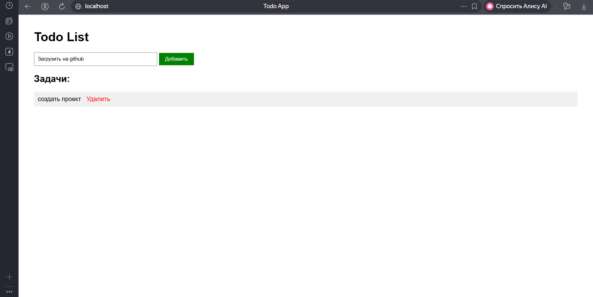

# Todo App — веб-приложение на Flask + PostgreSQL + Nginx

## Описание
Простое Todo-приложение (список задач) с использованием Flask, PostgreSQL и Nginx.

**Что вы увидите на скриншоте ниже — сможете запустить у себя.**

## 📊 Скриншоты



## Технологии
- Python / Flask
- PostgreSQL
- Nginx (reverse proxy)
- Docker / Docker Compose

## Как запустить

```bash
git clone https://github.com/aworkmailit-ai/webapp-docker.git
cd webapp-docker
docker-compose up -d